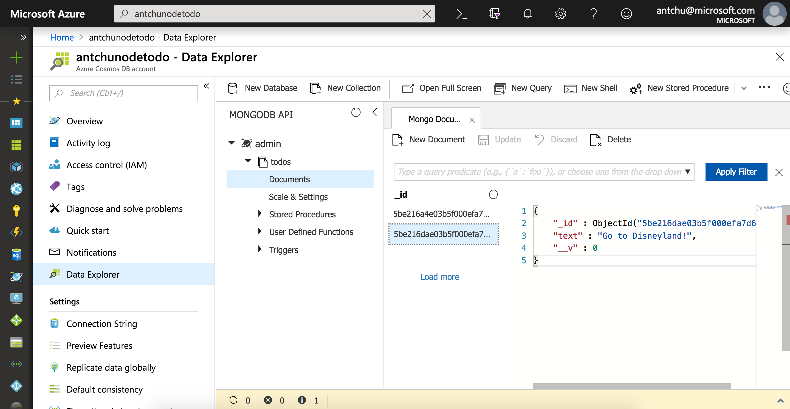

# Deploy a containerized web app to Azure App Service

## Introduction

### Technologies used

* Docker
* Azure Container Registry
* Azure App Service (Web App for Containers)

### Prerequisites

The following software is required to build this tutorial.

* [Git](https://git-scm.com/downloads)
* [Node.js](https://nodejs.org/en/download/) (Version 8 or higher)
* [Docker Desktop](https://www.docker.com/products/docker-desktop)
* [Azure CLI](https://docs.microsoft.com/en-us/cli/azure/install-azure-cli?view=azure-cli-latest&WT.mc_id=containersworkshop-github-antchu)
* [VS Code](https://code.visualstudio.com/download?WT.mc_id=containersworkshop-github-antchu) (recommended)
    - [Azure Tools extension](https://marketplace.visualstudio.com/items?itemName=ms-vscode.vscode-node-azure-pack&WT.mc_id=containersworkshop-github-antchu) (Optional)


## Run the application locally


### Clone the repository

The application you'll be deploying is a simple Node.js application with a MongoDB database.

1. Create a new directory and clone the repository that contains the Node.js application.

    ```
    git clone https://github.com/anthonychu/node-todo.git
    ```

1. In VS Code, open the folder containing the cloned repository.

### Build and run the application

The application requires access to a MongoDB server when it is run. You'll use Docker Compose to:

* Build and containerize the Node.js application
* Start a MongoDB server in a container
* Start the application in a container, which connects to MongoDB

#### Review the Docker and Docker Compose files

1. In VS Code, open and review the contents of the **Dockerfile**. It specifies the base image (`node:8-alpine`) and the steps used to build your container image.

1. Open and review the contents of the **docker-compose.yml** file. It instructs docker to start two containers, one with a MongoDB server and one with the main application.

#### Build and start the application with Docker Compose

1. In the directory containing **docker-compose.yml**, run the following command that will build and run the application:

    ```
    docker-compose up -d
    ```

1. Open a browser and navigate to the application at `http://localhost:8080`.

1. When you are done testing the application, shut down and delete the containers.

    ```
    docker-compose down
    ```

## Host the container image in Azure Container Registry

Before you can deploy your application in Azure, you need to make the application's Docker image available in a container registry. You'll use Azure Container Registry to build and host your container image for this lab.


### Create an Azure Container Registry

1. Before you can use the Azure CLI, make sure you have logged in. Run the following command and follow the instructions to log in.

    ```
    az login
    ```

1. View your subscriptions in table format:

    ```
    az account list -o table
    ```

1. Confirm that the subscription you would like to use for this lab is listed as the **default**. To change the default subscription, run this command:

    ```
    az account set -s "Name or SubscriptionId"
    ```

1. A resource group is a logical container for resources in Azure. Create a resource group named **node-todo-lab**:

    ```
    az group create -n node-todo-lab -l westus2
    ```

1. Create an Azure Container Registry (ACR) with a unique name (letters and numbers only). Set a variable named `REGISTRY_NAME` or replace `$REGISTRY_NAME` in the command with the name.

    ```
    az acr create -n $REGISTRY_NAME -g node-todo-lab -l westus2 --sku Standard --admin-enabled true
    ```

    > Note: The admin account is required for Azure App Service to authenticate with ACR.

### Build and push the Docker image to ACR

1. Build the Docker image using ACR. This command tags the image as `nodetodo:latest` and pushes it to your ACR.

    ```
    az acr build -t nodetodo:latest -r $REGISTRY_NAME .
    ```

1. Confirm that `nodetodo:latest` exists in your Azure Container Registry:

    ```
    az acr repository show-tags -n $REGISTRY_NAME --repository nodetodo
    ```


## Deploy the application to Azure

### Create an Azure Cosmos DB account

1. In the same resource group, create a Cosmos DB account (MongoDB API) with a unique name. Set a variable named `COSMOSDB_NAME` or replace `$COSMOSDB_NAME` in the command with the name.

    ```
    az cosmosdb create -n $COSMOSDB_NAME -g node-todo-lab --locations "westus2=0" --kind MongoDB
    ```

    > Note: Cosmos DB supports replication to multiple regions. Multiple regions and their failover priorities can be passed to the `--locations` parameter (failover priority starts at 0 which indicates the primary location).

### Deploy the application to Azure App Service

1. Retrieve information about your container registry and image, and store them into variables.

    ```
    ACR_SERVER=$(az acr show -n $REGISTRY_NAME --query loginServer -o tsv)
    ACR_USERNAME=$(az acr credential show -n $REGISTRY_NAME --query username -o tsv)
    ACR_PASSWORD=$(az acr credential show -n $REGISTRY_NAME --query passwords[0].value -o tsv)
    IMAGE_NAME=$ACR_SERVER/nodetodo:latest
    ```

    > Note: These commands are in bash syntax. They may differ slightly in other environments.

1. Create an Azure App Service plan with a unique name. An App Service plan can host one or more applications. Set a variable named `APP_SERVICE_PLAN_NAME` or replace `$APP_SERVICE_PLAN_NAME` in the command with the name.

    ```
    az appservice plan create -n $APP_SERVICE_PLAN_NAME -g node-todo-lab -l westus2 --sku S1  --is-linux
    ```

1. Create a web app with a unique name. Set a variable named `WEB_APP_NAME` or replace `$WEB_APP_NAME` in the command with the name.

    ```
    az webapp create -n $WEB_APP_NAME -g node-todo-lab -p $APP_SERVICE_PLAN_NAME --deployment-container-image-name $IMAGE_NAME
    ```

1. Configure the web app with the credentials to pull the image from ACR.

    ```
    az webapp config container set -n $WEB_APP_NAME -g node-todo-lab -i $IMAGE_NAME -u $ACR_USERNAME -p $ACR_PASSWORD
    ```

1. Set an application setting named **MONGODB_URL** with the connection string to the Cosmos DB account you created earlier.

    ```
    CONNECTION_STRING=$(az cosmosdb list-connection-strings -n $COSMOSDB_NAME -g node-todo-lab --query connectionStrings[0].connectionString -o tsv)
    az webapp config appsettings set -n $WEB_APP_NAME -g node-todo-lab --settings MONGODB_URL=$CONNECTION_STRING
    ```

1. Enable container logging to gain insights into the running application.

    ```
    az webapp log config -n $WEB_APP_NAME -g node-todo-lab --docker-container-logging filesystem
    ```

1. Retrieve the URL for your web app. Open it in a browser.

    ```
    echo https://$(az webapp show -n $WEB_APP_NAME -g node-todo-lab --query defaultHostName -o tsv)/
    ```

1. Stream the container logs in real-time.

    ```
    az webapp log tail -n $WEB_APP_NAME -g node-todo-lab
    ```

    Type `Ctrl-C` to exit.

1. Using the Azure portal or the Azure Cosmos DB VS Code extension, locate your Cosmos DB account. Browse to the *todos* collection.

    


## Bonus

### Deploy app to Azure Container Instances

Azure Container Instances is another way to deploy containers in Azure. Use a command like this one to run the container image you built earlier in ACI.

```
az container create -g node-todo-lab -n $ACI_NAME --image $IMAGE_NAME --registry-login-server $ACR_SERVER --registry-username $ACR_USERNAME --registry-password $ACR_PASSWORD --ip-address public --ports 80 -e "PORT=80" "MONGODB_URL=$CONNECTION_STRING"
```

### Geo-replicate and scale Cosmos DB

Azure Cosmos DB makes it easy to scale your database to handle high volumes and to geo-replicate your data to regions around the globe. 


## Summary

Congratulations! You have successfully containerized and deployed an application to Azure App Service and Azure Cosmos DB!


_Lab based on the [Node Todo App by scotch.io](https://github.com/scotch-io/node-todo)_